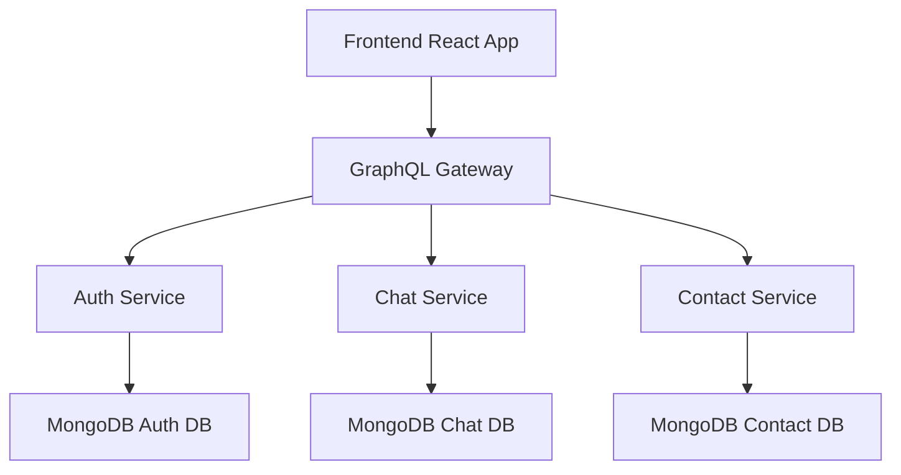

# MERN Chat Application

[](https://github.com/julihocc/mern-chat-app)
[](https://nodejs.org/)
[](https://reactjs.org/)
[](https://vitejs.dev/)
[](https://graphql.org/)
[](https://docker.com/)
[](https://kubernetes.io/)

A modern, real-time chat application built with the MERN stack, featuring microservices architecture, GraphQL API gateway, and comprehensive Test-Driven Development (TDD) setup.

## 🏗️ Architecture Overview

This application follows a **microservices architecture** with the following components:

### Core Services
- **🔐 AuthService** (v1.1.0) - Authentication and user management (Port: 5000, MongoDB: 27018)
- **💬 ChatService** (v1.1.0) - Chat rooms and messages (Port: 4500, MongoDB: 27020)
- **👥 ContactService** (v1.1.0) - User contacts management (Port: 4000, MongoDB: 27019)
- **🌐 Gateway** (v1.1.0) - GraphQL API gateway with federation (Port: 3001)
- **⚛️ Frontend** (v0.2.0) - React app with Vite and Apollo Client (Port: 3000)

### Key Features
- **Real-time messaging** with GraphQL subscriptions and WebSocket support
- **JWT-based authentication** with secure cookie storage
- **Microservices communication** via HTTP/GraphQL through the gateway
- **Modern build system** with Vite (migrated from Create React App)
- **Comprehensive TDD setup** with Vitest, React Testing Library, and MSW
- **Material-UI design system** with responsive layouts
- **Internationalization (i18n)** support with React i18next
- **Docker & Kubernetes deployment** support

## 🚀 Quick Start

### Prerequisites
- Node.js 18+
- Docker and Docker Compose
- MongoDB (or use Docker containers)

### Development Setup

#### Option 1: Docker Compose (Recommended)
```bash
# Clone and navigate to project
git clone https://github.com/julihocc/mern-chat-app.git
cd mern-chat-app

# Start all services with Docker
docker-compose up
```

#### Option 2: Local Development
```bash
# Install dependencies for all services
npm install # (if root package.json exists)

# Or install individually
cd authService && npm install
cd ../chatService && npm install
cd ../contactService && npm install
cd ../gateway && npm install
cd ../frontend && npm install

# Start services (in separate terminals)
cd authService && npm start    # Port 5000
cd chatService && npm start    # Port 4500
cd contactService && npm start # Port 4000
cd gateway && npm start        # Port 3001
cd frontend && npm run dev     # Port 3000
```

### Access Points
- **Frontend**: http://localhost:3000
- **GraphQL Gateway**: http://localhost:3001/graphql
- **Auth Service**: http://localhost:5000
- **Chat Service**: http://localhost:4500
- **Contact Service**: http://localhost:4000

## 🧪 Testing & TDD

The application now includes a comprehensive Test-Driven Development setup:

### Frontend Testing
```bash
cd frontend

# Run tests once
npm test

# Watch mode for TDD
npm run test:watch

# Coverage report
npm run test:coverage

# Visual UI interface
npm run test:ui

# Or use the convenience script
./test.sh           # Run all tests
./test.sh watch     # Watch mode
./test.sh coverage  # With coverage
./test.sh ui        # Visual interface
```

### Testing Stack
- **[Vitest](https://vitest.dev/)** - Fast, Vite-native testing framework
- **[React Testing Library](https://testing-library.com/react)** - Component testing utilities
- **[MSW](https://mswjs.io/)** - Mock Service Worker for API mocking
- **[jsdom](https://github.com/jsdom/jsdom)** - Browser environment simulation

### Documentation
- 📖 [Complete Testing Guide](./frontend/TESTING.md)
- 🎯 [TDD Workflow Example](./frontend/TDD_EXAMPLE.md)

## 🐳 Docker Deployment

### Development Environment
```bash
# Start all services with hot reloading
docker-compose up

# Build and start in background
docker-compose up -d

# View logs
docker-compose logs -f

# Stop services
docker-compose down
```

### Production Build
```bash
# Build production images
docker-compose -f docker-compose.prod.yml build

# Deploy to production
docker-compose -f docker-compose.prod.yml up -d
```

## ☸️ Kubernetes Deployment

### Minikube Setup
```bash
# Start Minikube
minikube start

# Deploy all services
kubectl apply -f minikube/auth-service/
kubectl apply -f minikube/chat-service/
kubectl apply -f minikube/contact-service/
kubectl apply -f minikube/gateway/
kubectl apply -f minikube/frontend/

# Check status
kubectl get pods
kubectl get services
kubectl get ingress

# Enable tunnel for local access
minikube tunnel
```

### Service Deployment Scripts
Each service includes deployment automation:
```bash
# Deploy individual services
node minikube/auth-service/deployAuthServiceComponents.js
node minikube/chat-service/deployChatServiceComponents.js
node minikube/contact-service/deployContactServiceComponents.js
node minikube/gateway/deployGatewayComponents.js
node minikube/frontend/deployFrontendComponents.js
```

## 📁 Project Structure

```
mern-chat-app/
├── authService/           # Authentication & user management
│   ├── src/
│   │   ├── controllers/   # Business logic
│   │   ├── models/        # Mongoose schemas
│   │   └── utils/         # Utilities & middleware
│   └── Dockerfile
├── chatService/           # Chat rooms & messaging
├── contactService/        # Contact management
├── gateway/               # GraphQL API gateway
│   ├── src/
│   │   ├── dataSources/   # Service integrations
│   │   ├── graphql/       # Schema & resolvers
│   │   └── utils/
├── frontend/              # React application
│   ├── src/
│   │   ├── components/    # React components
│   │   ├── test/          # Testing infrastructure
│   │   ├── hooks/         # Custom React hooks
│   │   ├── redux/         # State management
│   │   └── utils/         # Client utilities
│   ├── TESTING.md         # Testing documentation
│   ├── TDD_EXAMPLE.md     # TDD workflow guide
│   └── vitest.config.js   # Test configuration
├── minikube/              # Kubernetes manifests
├── docker-compose.yml     # Development environment
└── README.md
```

## 🔧 Development Workflow

### Adding New Features (TDD Approach)
1. **Write failing tests** first (Red phase)
2. **Implement minimal code** to pass tests (Green phase)
3. **Refactor and improve** code quality (Refactor phase)
4. **Update documentation** as needed

### Code Standards
- **ESLint** and **Prettier** for code formatting
- **Conventional Commits** for commit messages
- **Component-first** development with React
- **GraphQL-first** API design
- **Test coverage** targets: >80% statements, >75% branches

### Recommended VS Code Extensions
- ES7+ React/Redux/React-Native snippets
- GraphQL: Language Feature Support
- Vitest extension for testing
- Docker extension
- Kubernetes extension

## 🤝 Contributing

1. **Fork** the repository
2. **Create** a feature branch (`git checkout -b feature/amazing-feature`)
3. **Write tests** for your changes following TDD principles
4. **Commit** your changes (`git commit -m 'feat: add amazing feature'`)
5. **Push** to the branch (`git push origin feature/amazing-feature`)
6. **Open** a Pull Request

See [TESTING.md](./frontend/TESTING.md) for testing guidelines and [TDD_EXAMPLE.md](./frontend/TDD_EXAMPLE.md) for workflow examples.

## 📊 Service Dependencies



## 🔒 Security Features

- **JWT Authentication** with secure HTTP-only cookies
- **Rate limiting** (10k requests/hour per IP)
- **Input validation** and sanitization
- **CORS configuration** for cross-origin requests
- **Error handling** without sensitive data exposure
- **Password hashing** with bcrypt

## 📈 Performance Optimizations

- **Vite build system** for faster development and builds
- **GraphQL query optimization** with DataLoader patterns
- **MongoDB indexing** for efficient queries
- **React lazy loading** for code splitting
- **Docker multi-stage builds** for smaller images
- **CDN-ready assets** with proper caching headers

## 📝 License

This project is licensed under the MIT License - see the [LICENSE](LICENSE) file for details.

## 🎯 Roadmap

- [ ] Real-time typing indicators
- [ ] File sharing and media support
- [ ] Push notifications
- [ ] Mobile app with React Native
- [ ] Advanced user roles and permissions
- [ ] Chat room moderation tools
- [ ] Integration with external services (Slack, Discord)
- [ ] Performance analytics dashboard

## 📞 Support

For questions and support:
- 📧 **Email**: [Contact maintainer](mailto:julihocc@example.com)
- 🐛 **Issues**: [GitHub Issues](https://github.com/julihocc/mern-chat-app/issues)
- 📖 **Documentation**: [Wiki](https://github.com/julihocc/mern-chat-app/wiki)

---

**Built with ❤️ using the MERN stack and modern development practices**
